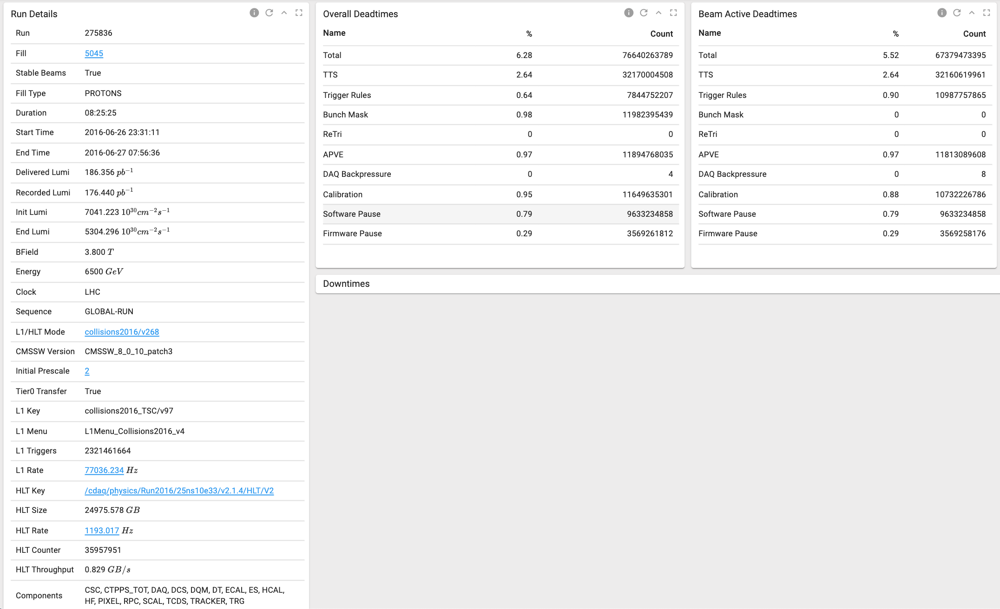
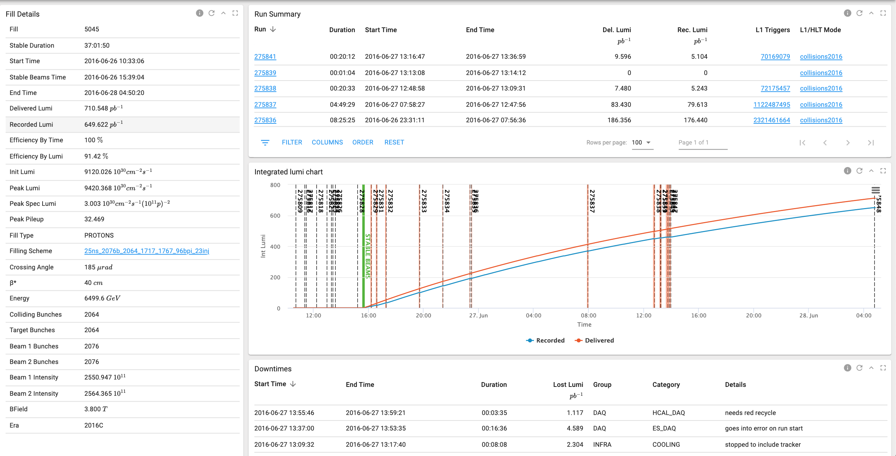
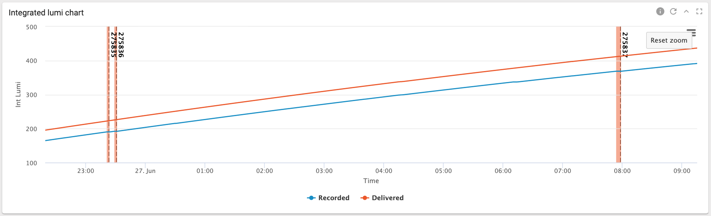
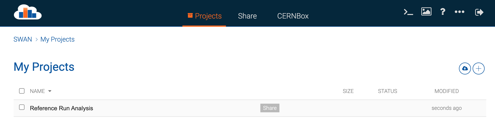
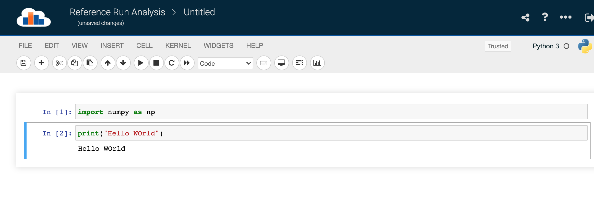

# **Reference Run Analysis**

In this project we aim to build a tool which can recommend a reference run to tracker offline shifters during the run certification process. We analyse run data from [OMS](https://cmsoms.cern.ch/cms/runs/) and data from [Certhelper](https://certhelper.web.cern.ch/). The later providing information on reference runs used during previous run certifications, which will be used for training and valdiating our tool. 


# Contents
1. [Data from OMS](#paragraph1)
2. [Data from Certhelper](#paragraph2)
3. [Environment Setup](#paragraph3)
    1. [Setup OMS APIs](#subpara31)
4. [Analysis on SWAN](#paragraph4)

# Data from OMS <a name="paragraph1"></a>
OMS contains parameters of all the runs that have been registered by the CMS detector. The datasets are organised with varying degree of granularity - Fill, Run and Lumisection. 

We can look at the following example where data for Run 275836 is retreieved. [Run report 275836](https://cmsoms.cern.ch/cms/runs/report?cms_run=275836&cms_run_sequence=GLOBAL-RUN)



- The run belongs to Fill 5045, which can retreived by clicking on the fill number. [Fill report 5045](https://cmsoms.cern.ch/cms/fills/report?cms_fill=5045)
- This fill information is also useful for us since we will be using integrated luminosity profile to compare different runs. (see below)



After our discussions we have determined the following paramters of interest from OMS to analyse runs 
1. Duration 
2. Colliding bunches 
3. Initial Integrated Luminosity 
4. End Integrated Luminosity 
5. APV Mode (Only for Comsics)
6. Number of PV 

The zoomed in version of Int. Lumi from Fill report page - 


There is a page [Shifter Twiki](https://twiki.cern.ch/twiki/bin/view/CMS/TrackerOfflineReferenceRuns?sortcol=1;table=3;up=1#sorted_table) which contains suggestions for reference run to be used by shifter. As we note until now there are only a small number of runs which are to be used for certification of all runs. And the process is manual i.e the shifter has to compare and pick from this finite set. 

# Data from Certhelper <a name="paragraph2"></a>
To fetch data from Certhelper an API was setup which provides all the runs and reference pairs which were used in conjunction during previous data certifications. 

Here is an example of such a pair that is returned by the API - 
```
{
"run_number": 306553, 
"run_reconstruction_type": "rereco",
"reference_run_number": 305810,
"reference_run_reconstruction_type": "express", 
"dataset": "/SingleTrack/Run2017G-17Nov2017-v1DQMIO"
}
```

[API - See Note below](https://certhelper.web.cern.ch/mldatasets/allRunsRefRuns/)

- **(Note) The API does not require any authentication, so please do not share the API or use it repeatedly. We want to avoid the overloading of Certhelper Database.**

In future we plan to move to API to a different platform to avoid this issue.

There is also a JSON file (runRefRunPairs.json) which contains all such pairs until 02.10.2021 which should suffice for our analysis

# Environment Setup <a name="paragraph3"></a>
The section contains information on installing necessary softwares and libraries. And registering an account for fetching information form APIs. 

### Setup OMS APIs <a name="subpara31"></a>
To access the OMS API we need a client id and secret key which has to be obtained via the procedure given on these [slides](https://indico.cern.ch/event/997758/contributions/4191705/attachments/2173881/3670409/OMS%20CERN%20OpenID%20migration%20-%20update.pdf). Page 4-6 are relevent for our use case. 

- (Note) While filling the registration form, in section Redirect URI you can fill any arbitrary url since we use the API from SWAN (See below)

# Analysis on SWAN <a name="paragraph4"></a>
We use [SWAN](https://swan004.cern.ch/hub/spawn) - A platform to perform interactive data analysis on the cloud. 

We place the files containing the data on EOS (CernBOX) and use it inside jupyter notebooks running on SWAN.

### Basic setup 
#### Configure Environment 
You need to first setup an environment by specifying 
- Software stack (96 Python3)
- Platform (CentOS)
- Number of Cores (2)
- Memory (8 GB)

#### Create a new Project. 
Click ('+') on top left to create a new project. e.g. We have created a project titled 'Reference Run Analysis'. 



#### Create a jupytet notebook.
Once we have a project. We can create notebooks inside this folder. 

